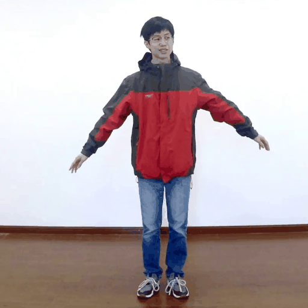

# Animatable Neural Radiance Fields from Monocular RGB Videos
### [Github](https://github.com/JanaldoChen/Anim-NeRF) | [Paper](https://arxiv.org/abs/2106.13629)

> [Animatable Neural Radiance Fields from Monocular RGB Videos](https://arxiv.org/abs/2106.13629)    
> Jianchuan Chen, Ying Zhang, Di Kang, Xuefei Zhe, Linchao Bao, Xu Jia, Huchuan Lu

### Demos

#### Novel View Synthesis and 3D Reconstruction

* male-3-casual

    </img></img>

* female-3-casual

    </img></img>

* male-4-casual

    </img></img>

* female-4-casual

    </img></img>

* iper_023_1_1

    </img></img>

#### Shape Editing

* male-3-casual

    </img>

* female-4-casual

    </img>

The code will be available soon!

